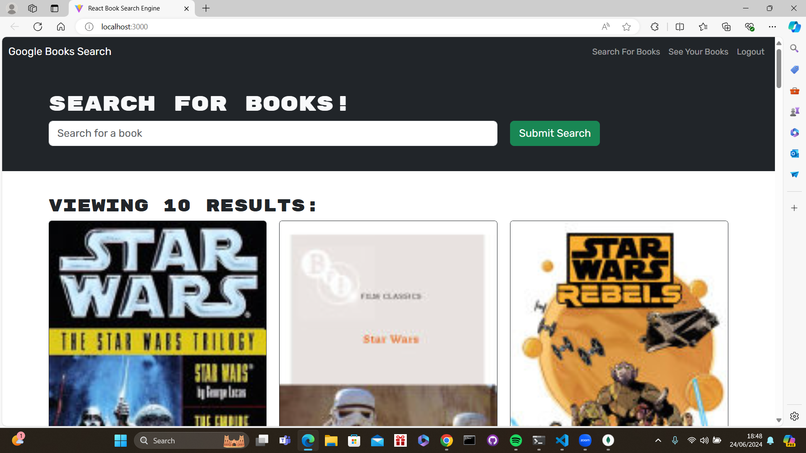

# MERN-Book-Search-Engine

## WHat was my objective and what have i accomplished?
In this project i was tasked with creating a fully functioning Book Search Engine, which I have successfully been able to my allowing the user to search any book via the search bar on the application. I was also able to ensure that the user can save any book to their dashboard once they are logged in. However if the user then wants to remove this from the dashboard i have also added in a function that allows the user to remove a book from their saved books dashboard.

